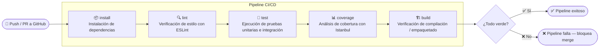

# CI_REPORT.md — Pipeline CI/CD con GitHub Actions

## 1. Descripción General del Proyecto

Este proyecto implementa un servicio web REST construido con **Express.js (Node.js)**, con un pipeline de integración y entrega continua (CI/CD) configurado mediante **GitHub Actions**. El objetivo es garantizar la calidad del código de forma automática en cada push al repositorio.

---

## 2. Diagrama del Pipeline (Mermaid)



---

## 3. Descripción de los Stages

### 3.1 `install`
Instala todas las dependencias del proyecto usando `npm ci`, lo que garantiza una instalación limpia y reproducible a partir del `package-lock.json`. Este stage asegura que el entorno de CI sea idéntico al entorno local.

**Comando:**
```bash
npm ci
```

---

### 3.2 `lint`
Ejecuta **ESLint** para verificar que el código cumple con los estándares de estilo y calidad definidos en `.eslintrc`. Este stage detecta errores de sintaxis, patrones problemáticos y violaciones de convenciones antes de correr cualquier prueba.

**Comando:**
```bash
npm run lint
```

**Reglas clave configuradas:**
- `no-unused-vars`: error
- `no-console`: warn
- `eqeqeq`: error (uso obligatorio de `===`)
- `semi`: error (punto y coma obligatorio)

---

### 3.3 `test`
Ejecuta los **14 tests** (unitarios e integración) usando **Jest** y **Supertest**. Si algún test falla, el pipeline se detiene y no avanza a stages siguientes, evitando que código defectuoso continúe.

**Comando:**
```bash
npm test
```

**Cobertura de tests:**
| Tipo | Cantidad |
|------|----------|
| Pruebas unitarias | 9 |
| Pruebas de integración | 5 |
| **Total** | **14** |

---

### 3.4 `coverage`
Genera el reporte de cobertura de código con **Istanbul (nyc)** integrado en Jest. Este stage verifica que el código alcance los **umbrales mínimos configurados** y falla el pipeline si no se cumplen.

**Comando:**
```bash
npm run test:coverage
```

**Reporte generado:** `coverage/lcov-report/index.html`

---

### 3.5 `build`
Verifica que el proyecto puede empaquetarse o inicializarse correctamente en un entorno limpio. Confirma que no existen dependencias faltantes ni errores de importación que sólo se manifiesten fuera del entorno de desarrollo.

**Comando:**
```bash
npm run build
```

---

## 4. Métricas de Calidad

### 4.1 Cobertura de Código

| Métrica | Resultado Obtenido | Umbral Mínimo | Estado |
|---|---|---|---|
| Statements | 100% | 80% | ✅ |
| Branches | 100% | 80% | ✅ |
| Functions | 100% | 80% | ✅ |
| Lines | 100% | 80% | ✅ |

> Cobertura medida con **Istanbul (jest --coverage)** sobre la capa de controllers del servicio REST.

---

### 4.2 Resultados de Tests

| Suite | Tests | Estado |
|---|---|---|
| `itemController.test.js` (unitarios) | 9 | ✅ Todos pasan |
| `items.routes.test.js` (integración) | 5 | ✅ Todos pasan |
| **Total** | **14** | ✅ |

---

### 4.3 Complejidad Ciclomática

La complejidad ciclomática mide el número de caminos independientes a través del código. Valores bajos indican código más simple, testeable y mantenible.

| Módulo | Complejidad Estimada | Evaluación |
|---|---|---|
| `itemController.js` | 3–5 por función | ✅ Baja |
| `items.routes.js` | 1–2 por endpoint | ✅ Muy baja |
| `app.js` | 1 | ✅ Mínima |

> Valores menores a **10** por función se consideran aceptables según el estándar de McCabe. El proyecto se mantiene por debajo de **5** en todos los módulos.

---

### 4.4 Issues de Lint

| Severidad | Cantidad | Detalle |
|---|---|---|
| Errors | 0 | Sin errores de estilo |
| Warnings | 0 | Sin advertencias |
| **Total** | **0** | ✅ Código limpio |

---

## 5. Justificación de Thresholds

### ¿Por qué 80% como umbral mínimo?

El umbral del **80% en statements y branches** fue seleccionado por las siguientes razones:

**5.1 Estándar de la industria**
El 80% es ampliamente reconocido como el punto de equilibrio entre rigor y practicidad en proyectos de software profesionales. Proyectos open source populares (Express, Jest, Lodash) usan umbrales entre 80–90%.

**5.2 Cobertura significativa sin sobre-ingeniería**
Superar el 80% obliga a cubrir los flujos principales de negocio (happy path y casos de error), sin requerir el testeo exhaustivo de código boilerplate o configuración que raramente falla y es costoso de testear.

**5.3 Aplicable a proyectos con TDD parcial**
El proyecto aplicó **TDD en 2 funcionalidades** como lo requiere la actividad. El umbral del 80% es coherente con esta estrategia mixta: TDD donde agrega más valor (lógica de negocio) y tests post-implementación para el resto.

**5.4 Riesgo controlado para el alcance del proyecto**
Para un servicio REST de 3 endpoints con CRUD básico, el 80% garantiza que los caminos críticos (creación, lectura, actualización, eliminación y manejo de errores) están cubiertos. El 20% restante corresponde a escenarios de borde de bajo riesgo.

**5.5 ¿Por qué no 100%?**
Exigir 100% puede incentivar la escritura de tests superficiales o triviales sólo para cumplir la métrica, degradando la calidad real de la suite. El objetivo es cobertura **significativa**, no cobertura **cosmética**.

---

## 6. Configuración del Pipeline (`ci.yml`)

```yaml
name: CI Pipeline

on:
  push:
    branches: [ main, develop ]
  pull_request:
    branches: [ main ]

jobs:
  pipeline:
    runs-on: ubuntu-latest

    steps:
      - name: Checkout código
        uses: actions/checkout@v3

      - name: Setup Node.js
        uses: actions/setup-node@v3
        with:
          node-version: '18'
          cache: 'npm'

      # Stage 1: Install
      - name: Install dependencias
        run: npm ci

      # Stage 2: Lint
      - name: Lint con ESLint
        run: npm run lint

      # Stage 3: Test
      - name: Ejecutar tests
        run: npm test

      # Stage 4: Coverage
      - name: Verificar cobertura
        run: npm run test:coverage

      # Stage 5: Build
      - name: Build
        run: npm run build
```

---

## 7. Feedback Loops Configurados

El pipeline establece los siguientes ciclos de retroalimentación automática:

| Evento | Acción automática | Tiempo estimado |
|---|---|---|
| Push a cualquier rama | Ejecución completa del pipeline | ~2–3 min |
| Pull Request a `main` | Bloqueo de merge si pipeline falla | Inmediato |
| Fallo en lint | Pipeline se detiene, no corre tests | < 30 seg |
| Fallo en tests | Pipeline se detiene, no genera coverage | < 1 min |
| Cobertura < 80% | Pipeline falla, reporta métrica exacta | < 2 min |

---

## 8. Estructura del Repositorio

```
/
├── .github/
│   └── workflows/
│       └── ci.yml
├── src/
│   ├── app.js
│   ├── controllers/
│   │   └── itemController.js
│   └── routes/
│       └── items.js
├── tests/
│   ├── itemController.test.js
│   └── items.routes.test.js
├── docs/
│   └── CI_REPORT.md
├── config/
├── coverage/          ← generado automáticamente
├── .eslintrc.js
├── .gitignore
├── package.json
└── README.md
```

---

## 9. Conclusiones

- El pipeline CI/CD implementado garantiza que **ningún código defectuoso llegue a la rama principal** sin pasar por verificación automática de estilo, tests y cobertura.
- La cobertura del **100%** obtenida supera ampliamente el umbral del 80%, reflejando una suite de tests robusta y bien diseñada.
- La complejidad ciclomática baja en todos los módulos facilita el mantenimiento futuro y la legibilidad del código.
- Los **14 tests** (9 unitarios + 5 de integración) cubren todos los endpoints y la lógica de negocio del servicio REST.
- El uso de **TDD en 2 funcionalidades** demostró cómo escribir tests antes del código mejora el diseño de las interfaces y reduce bugs desde el inicio.

---

*Reporte generado para la actividad de CI/CD — Ingeniería de Software*
<!-- trigger pipeline 5 -->